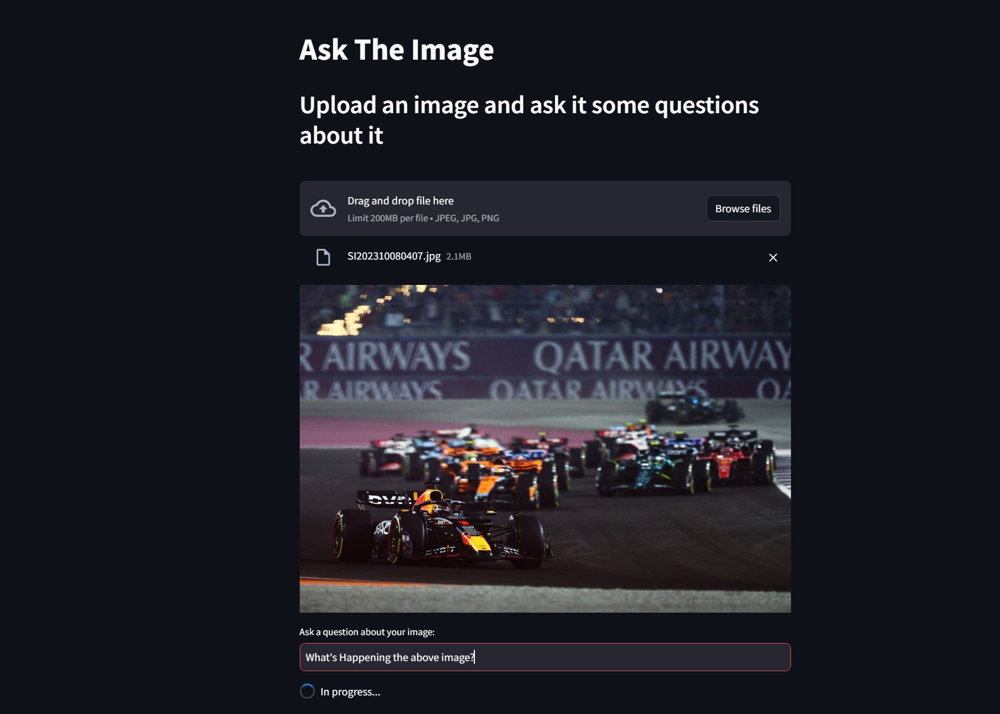

# Ask The Image

This is a Streamlit application that allows users to ask questions about an uploaded image and receive responses from a conversational AI agent. The agent leverages the OpenAI GPT-3.5 Turbo model to generate answers based on the provided image and user questions.

